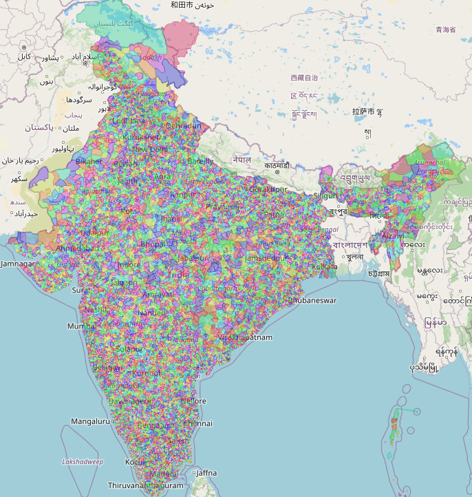
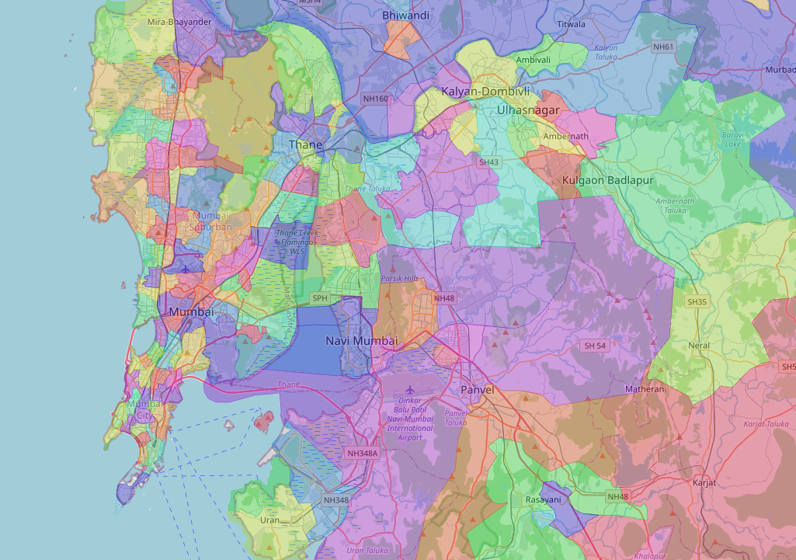
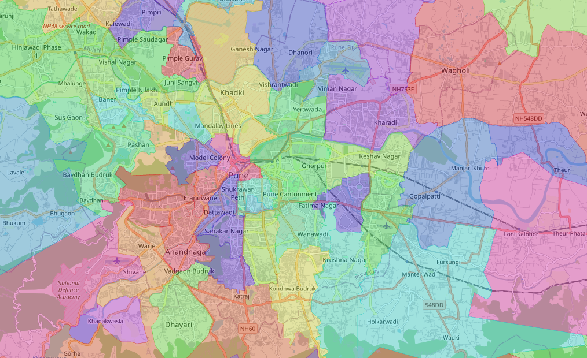

# GeoJSON Visualizer

This project is a **simple single-file HTML visualizer** for geo json polygons.  
It uses [Leaflet.js](https://leafletjs.com/) to render the polygons directly on a map.

🔗 Example deployed version: [geojson.devharshgupta.com](https://geojson.devharshgupta.com/)

---

## 🚀 Features
- 100% inline HTML — no build tools or backend needed.
- Works **locally** (just open in your browser) or can be deployed anywhere (e.g. GitHub Pages, Vercel, Netlify).
- Interactive Leaflet map:
  - Zoom & pan around India.
  - Click polygons to see **additional details about your features**.
  - Toggle polygon fill for better performance.
  - Auto-fit to India’s bounding box.

---

## 📦 How to Use

1. Clone or download this repository.
2. Open the `index.html` file directly in a browser.  
   *(No server required! Works offline.)*
3. Or deploy it to any static host (GitHub Pages, Vercel, Netlify, etc).

---

## 🛠️ How It Works

- Leaflet.js draws all polygons on an interactive OpenStreetMap background.
- The map defaults to India’s center (`21.0, 78.0`) at zoom `5`.

---

## 📂 Files

- `index.html` → Single file containing **map + data + logic**.
- `README.md` → This documentation.

---

## 🖼️ Preview

---

## ⚡ Notes

- The large dataset loading might take a few seconds/minutes.

---
